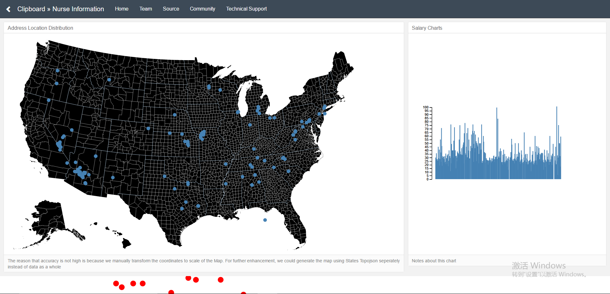
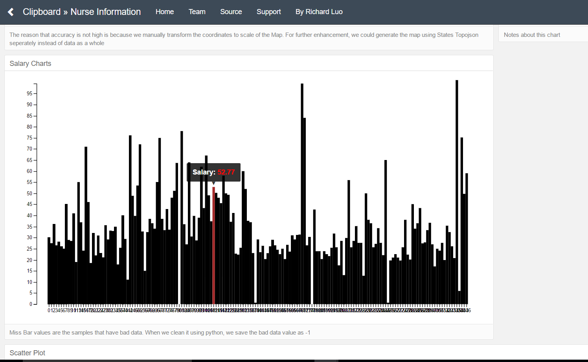

# Clipboard-Health-Coding-Challenge

----------------------------------------------------Overview---------------------------------------------------------------------------

	1. This web project built for data visualization. Its main purpose is to provide nurse candidates information for hospitals. This is a coding test from Clipboard Health
	2. The techniques we used are Python for data cleaning and ingestion, Mongoose/Pymongo for data storage, React+d3 for frontend presentation, nodejs for backend server control, mocha for test, webpack/babel/yarn/virtualenv and other packages for integration and management. 
	3. The data to be handled is stored as /data/projectnurse.csv. 
	4. in /myFolder is the preliminary web page that I developed for data visualization.
	5. The MapUs component created a map of united states, and present the nurse location(latitude, longitude) on the map.
	6. the Barchart and D3Chart component created simple bar charts that show the salaries of each nurse. 
	7. Graph and Datagraph created scatter plot, which is not necessarily related to this project.
	8. clean.py is for python data cleaning. /model/MyRecord for mongo database schema.
	9. you can see the preliminary results in the following images

  
  

----------------------------------------------------Detail---------------------------------------------------------------------------

Python:

	1. Transfer data to lowercase to avoid duplicates.
	2. use regular expression to retrieve data from dataframe columns.
	3. install geocoder to obtain latitude and longitude. use time.sleep because of google api query limit. In this case, I stored the latitude and longitude in text files to load in python for saving time.
	4. input data:  pay attention to null or, 'none' , float NaN problem.
	5. Time and dates recognition.  2 weeks, 1 year..... I stored all the related keywords and iterate the salary data, converting to hourly salary rate. Handled dot and comma  problems in numbers. Handles multiple dimension salary problems, say 'xx/hr, satisfied with xx/yr, least expection xxx/biweek'. 
	6. how to treat unexpected data.  dropped single-digit number of bad data, res-save it as -1. 
	7. format to store data every stage of pipeline obtain data from db since we don't want to pollute the raw data
	8. input data "salary" and "patientNurseRatio" are quit messy to handle. I would suggest to validate input nurse data in the first place, such as number check in the user interface.

You can see a draft on jupyter:<a src="./healthcare_challenge.html">here</a>

React-D3

	1. react-d3 strategy:  use d3 to perform data math function and manipulation. use react for data presentation. This is because when the development scales up, directly querying Dom in componentDidMount etc will cause an disorder together with react re-render. D3 select itself may go out of dimension
	2. In this project, I used d3 geopath(), scale, axis and other functions to compute the data. 
	3. store ajax data in state so when asynchronous data loaded we use setState to re-render page. handle all ajax in componentDidMount life cycle.
	4. re-render issues: when ajax data not loaded yet, I return a different jsx page for either error or loading. Then when data in state loaded and page re-rendered , return the full page with sub-component.
	5. store all records from database to root element <myComponent> so that every inherited sub-ele can access and we need only query data once. Neither do we have care about props change since we only load sub-component when state data loaded. No setState will be triggerred again in root component.
	6. visualize data on the map and barchart. Only d3.chart used pure d3.js to present. others merely used d3 to manipulate math function in data.
	7. design dashboard
	8. dependencies added:  axios, topojson, d3-tip
	9. 

Nodejs and Mongo:

	1. explicitly specify collection in query is a good choice for recognizing database collections. const MyRecord = new Schema({}, { collection:'MyRecords' }); A couple of time I could not load mongo maybe because either collection names are similar or schema not fully matched. With collection specified it's easier for mongo to recognize
	2. 

Next Step

	* further refractoring. We cannot store all asynchronous data in root component. When scale goes large, project needs to be re-designed.
	* test. Edge/corner cases, error handling
	* optimization for variable naming, speed, load balance, and portability.

